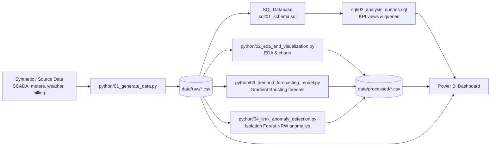

# Architecture & Data Flow

## Layer responsibilities

| Layer | Tool | Responsibility |
|---|---|---|
| Data generation | Python | Produces a realistic multi-year dataset across 8 zones: consumption, weather, pipe network, leaks, billing |
| Storage / modeling | SQL | Relational schema, indexes, and reusable analytical queries (NRW %, per-capita demand, YoY growth, revenue risk) |
| Analysis | Python (pandas, seaborn) | Exploratory data analysis, seasonality and correlation charts |
| Predictive analytics | Python (scikit-learn) | Gradient Boosting demand forecast (~1.5% MAPE on held-out 90 days) and Isolation Forest leak/NRW anomaly detection |
| Visualization | Power BI | Executive dashboard: city overview, forecasting, leakage/infrastructure risk, billing & revenue |

## Why this design

- **Zone-level granularity** mirrors how real utilities segment a city (District Metered Areas), which is what makes NRW% and leak detection meaningful.
- **Production vs. billed** split is the backbone of the Non-Revenue Water (NRW) KPI, the single most-watched metric in water utility operations.
- **Per-zone anomaly detection** (rather than one citywide model) avoids masking a small zone's leak inside citywide averages.
- **Calendar + weather + lag features** in the forecasting model reflect the real drivers of urban water demand: seasonality, weekday/weekend behavior, temperature, and recent trend.
